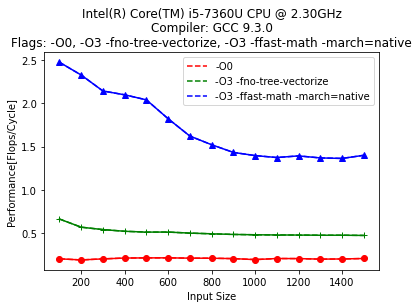
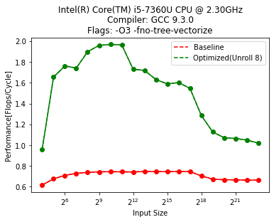
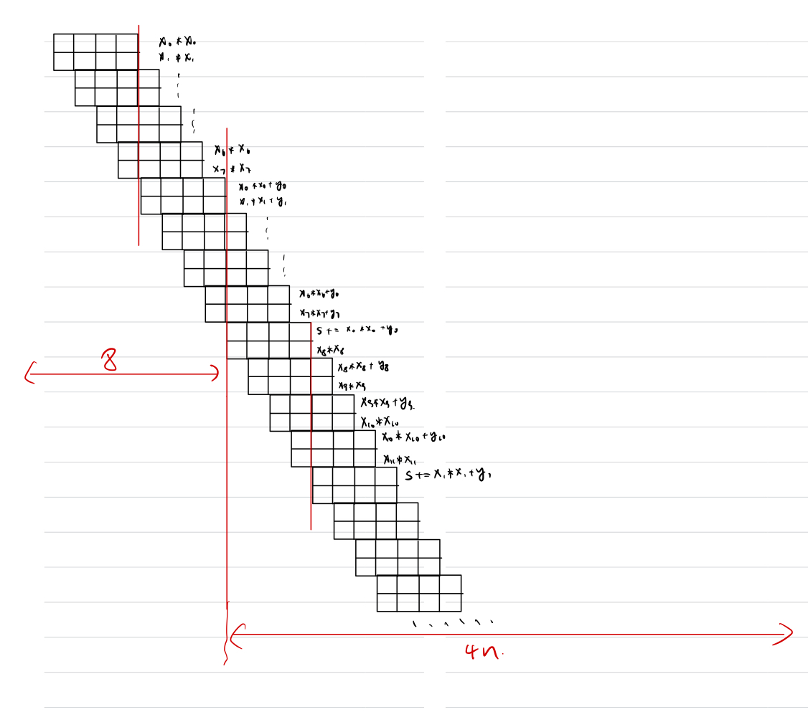
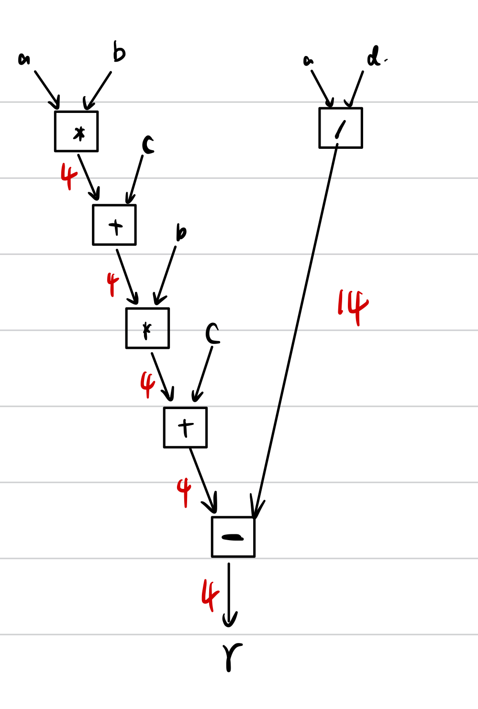
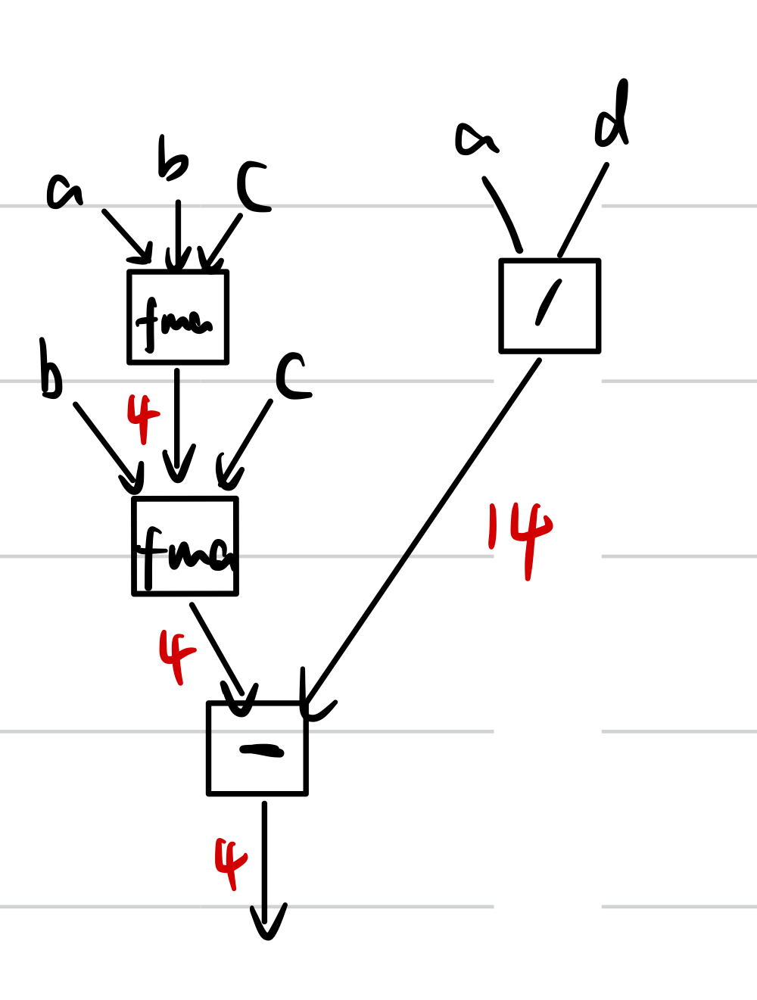

# Advanced System Lab: Assignment 1 Report

## 1. Get to know your machine

Determine and create a table for the following microarchitectural parameters of your computer:

* (a) Processor manufacturer, name, number and microarchitecture (e.g. Haswell, Skylake, etc).
  
  * **Manufacturer: Intel**
  * **Name & number: Intel(R) Core(TM) i5-7360U CPU @ 2.30GHz**
  * **Microarchitecture: Kaby Lake - 7th Generation Intel Core**
  
* (b) CPU base frequency: **2.30GHz**

* (c) CPU maximum frequency. Does your CPU support Turbo Boost or a similar technology?
  * **Maximum frequency: 3.60GHz**
  * **Turbo Boost is supported**
  
* (d) Phase in the Intel’s development model: Tick, Tock or Optimization. (if applicable): **Optimization**

  | Information       | Attribute                                |
  | ----------------- | ---------------------------------------- |
  | Manufacturer      | Intel                                    |
  | Name & number     | Intel(R) Core(TM) i5-7360U CPU @ 2.30GHz |
  | Microarchitecture | Kaby Lake - 7th Generation Intel Core    |
  | Base frequency    | 2.30GHz                                  |
  | Maximum frequency | 3.60GHz                                  |
  | Turbo boost       | Supported                                |
  | Development model | Optimization                             |

Intel’s processors offer two assembly instructions to compute scalar floating-point multiplication in single precision, namely FMUL (from x87) and MULSS (from SSE).

* (e) Which instruction is used when you compile code in your computer and why is the other one still supported?
  * MULSS from SSE is used in my computer
  * The other one is supported for backward compatibility
* (f) What is x87 and why is it called that way?
  * x87 is a floating-point-related extention of x86 instruction set.
  * The 87 is from math coprocessors (8087).

For one core and without using SIMD vector instructions determine the following (make sure to use the correct floating-point instruction in (h)-(j)).

* (g)  Maximum theoretical floating-point peak performance in flops/cycle.

  * Two FMA(Fused Multiply-Add) are issued per cycle, there are 4 flops/cycle.

* (h)  Latency[cycles], throughput[ops/cycle] and instruction name for both double-and single-precision floating-point subtraction.

  |                                             | Instruction Name | Latency[cycles] | Throughput[ops/cycle] |
  | ------------------------------------------- | ---------------- | --------------- | --------------------- |
  | Double-precision floating-point subtraction | SUBSD            | 4               | 2                     |
  | Single-precision floating-point subtraction | SUBSS            | 4               | 2                     |

* (i)  Latency[cycles] ,throughput[ops/cycle] and instruction name for both double-and single-precision floating-point division.

  |                                          | Instruction Name | Latency[cycles] | Throughput[ops/cycle] |
  | ---------------------------------------- | ---------------- | --------------- | --------------------- |
  | Double-precision floating-point division | DIVSD            | 13 - 14         | 1/4                   |
  | Single-precision floating-point division | DIVSS            | 11              | 1/3                   |

* (j)  Latency [cycles], throughput [ops/cycle] and instruction name for single-precision floating-point approximate reciprocal square root.

  |                                                              | Instruction Name | Latency[cycles] | Throughput[ops/cycle] |
  | ------------------------------------------------------------ | ---------------- | --------------- | --------------------- |
  | single-precision floating-point approximate reciprocal square root. | VRSQRT14SS       | 4               | 1                     |

## 2. Matrix Multiplication

* (b) Inspect the `compute() `function in `mmm.c` and answer the following:

  * i. Determine the exact number of floating-point additions and multiplications that it performs.

    * Additions: $n^3$
    * Mutiplications: $n^3$

  * ii. Determine an upper bound on its operational intensity (consider only reads and assume empty caches).

    * Flops: $=2n^3$
    * Memory transfers (doubles): $\geq 2n^2$
    * Reads (bytes): $\geq 16n^2$
    * Operational intensity: $I(n) \leq I_{read}(n) \leq n/8$

    Upper bound: $n/8$

* (c)  For all square matrices of sizes n between 100 and 1500, in increments of 100, create a performance plot with n on the x-axis and performance (flops/cycle) on the y-axis. Create three series such that:

  * i. The first series has all optimizations disabled: use flag `-O0`.

  * ii. The second series has the major optimizations except for vectorization: use flags `-O3` and `-fno-tree-vectorize`.

  * The third series has all major optimizations enabled: use flags `-O3`, `-ffast-math` and `-march=native`.

    

* (d) Discuss performance variations of your plots and report the highest performance that you achieved.

  * i. In this compilation mode, the code is neither optimized nor vectorized. Therefore, the performance is slow, and stable for different input size.
  * ii. In this compilation mode, the code is optimized but not vectorized. The performance is better than the previous one. But the performance is determined by latency of the operation since there is sequential dependence.
  * iii. In this compilation mode, the code is both optimized and vectorized. Therefore, the performance is significantly better than the previous two methods. Notice that the performance is better when the input size is small, this might caused by the limitation of cahce memory. 

## 3. Performance analysis and bounds

* (a) Define a suitable detailed floating-point cost measure $C(n)$.
  $$
  C(n) = C_{mul} * N_{mul} + C_{sub} * N_{sub} + C_{add} * N_{add}
  $$

* (b) Compute the cost $C(n)$ of the computation.
  $$
  N_{mul} = 3n, N_{sub} = n, N_{add} = n \\
  C(n) = 3n*C_{mul} + n*C_{sub} + n*C_{add}
  $$

* (c) Consider only one core without using vector instructions (i.e. using flag `-fno-tree-vectorize`) and determine a hard lower bound (not asymptotic) on the runtime (measured in cycles), based on:

  * i. The throughput of the floating-point operations. Assume that no FMA instructions are used. Be aware that the lower bound is also affected by the available ports offered for the computation (see lecture slides).

    * Note that by checking the Intel document, subtraction has the same port, throughput and latency as addition. 

    $$
    3n/2(MUL) + n/2(ADD) + n/2(SUB) = 5n/2\ cycles
    $$

  * ii. The throughput of the floating-point operations where FMAs are used to fuse an addition and a multiplication (i.e. `-mfma` flag is enabled).
    $$
    n/2(FMA) + 2n/2(MUL) + n/2(SUB) = 2n\ cycles
    $$

  * iii. The throughput of data reads, for the following two cases: All floating-point data is **L2-resident**, and all floating-point data is **RAM-resident**. Consider the best case scenario (peak bandwidth and ignore latency). Note that arrays that are only written are also read and this read should be included.

    * L2-resident: $4n/8 = n/2\ cycles$
    * RAM-resident: $4n/2 = 2n\ cycles$

* (d) Determine an upper bound on the operational intensity. Assume empty caches and consider only reads but note: arrays that are only written are also read and this read should be included.
  $$
  I(n) \leq I_{read}(n) \leq {5n\ flops \over 8*(4n)\ bytes} = {5\over 32}
  $$

## 4. Basic optimization

* (a) Create a benchmarking infrastructure based on the timing function that produces the most consistent results in Exercise 2 and for all two-power sizes $n = 2^4, . . . , 2^{23}$ create a performance plot for the function `comp ` with $n$ on the $x$-axis (choose logarithmic scale) and performance (in flops/cycle) on the $y$-axis. Randomly initialize all arrays. For all $n$ repeat your measurements $30$ times reporting the median in your plot. Compile your code with flags `-O3 -fno-tree-vectorize`.

  

* (b) Considering the latency and throughput information of floating-point operations in your machine, and the dependencies in comp, derive an upper bound on the performance (flops/cycles) of `comp` when using the specified flags in (a), i.e., when FMA and vector instructions are disabled (flag `-mfma` is not used and `-fno-tree-vectorize` is enabled).

  |                                                | Instruction Name | Latency[cycles] | Throughput[ops/cycle] |
  | ---------------------------------------------- | ---------------- | --------------- | --------------------- |
  | Double-precision floating-point addition       | ADDSD            | 4               | 2                     |
  | Double-precision floating-point multiplication | MULSD            | 4               | 2                     |

  * How many cycles at least for `s += x[i]*x[i] + y[i]` (assume $n >> 8 $):
    * The parallelization is shown in the picture
    * `x[i]*x[i]` , then `x[i]*x[i] + y[i]` for each `i=0,1,2,...,7`: $8$ Cycles
    * Addition `s += x[i]*x[i] + y[i] `  for each `i` given `x[i]*x[i] + y[i]`: $latency*n=4n$
  * Upperbound of performance: $performance\leq {3n \over 4n + 8} \approx 0.75 \ flops/cycle$  ($0.75 < {3n \over 4n + 8}$)

* (c)  Perform optimizations that increase the ILP of function comp to improve its runtime. It is not allowed to use FMA or vector instructions. Add the performance to the previous plot (so one plot with two series in total for (a) and (c)). Compile your code with flags `-O3 -fno-tree-vectorize`.

  * The plot is shown in (a)
  * `x[i]*x[i]` , then `x[i]*x[i] + y[i]` for each `i`: $ceil(2n/2) = n$ Cycles
  * Addition `s += x[i]*x[i] + y[i] `  for each `i` given `x[i]*x[i] + y[i]`: $ceil(n/8*4)=n/2$
  * Upperbound of performance: $performance\leq {3n \over 3/2n} =2 \ flops/cycle$

* (d)  Discuss performance variations of your plot and report the highest performance that you achieved.

  * The performane is improved by unrolling. However, the performane is different for different input size. This probably caused by the cache size. 
    * Performance is the best when the input can be stored in the L1 cache.
    * The decreasing stage contains three step, which represents L1, L2, L3. 
  * The highest performance is 1.969

## 5. ILP analysis

(a) The latency, throughput and dependencies of the floating-point arithmetic operations. Assume that no FMA instruction is generated (i.e. -mfma flag is not used). Be aware that the lower bound is also affected by the available ports offered for the computation (see lecture slides).

* There are $4 + 4 + 4 + 4 + 4 = 20\ cycles$ on the critical path. The multiplication and addition operations are issued on port 0 and 1 (port 0 is only used after division is finished), division is issued on port 0.

(b) The latency, throughput and dependencies of the floating-point arithmetic operations when FMAs are enabled to fuse an addition and a multiplication (i.e. -mfma flag is used).

* There are $14 + 4 = 18\ cycles$ on the critical path. The fma operations are issued on port 1 (port 0 is only used after division is finished), division is issued on port 0.
