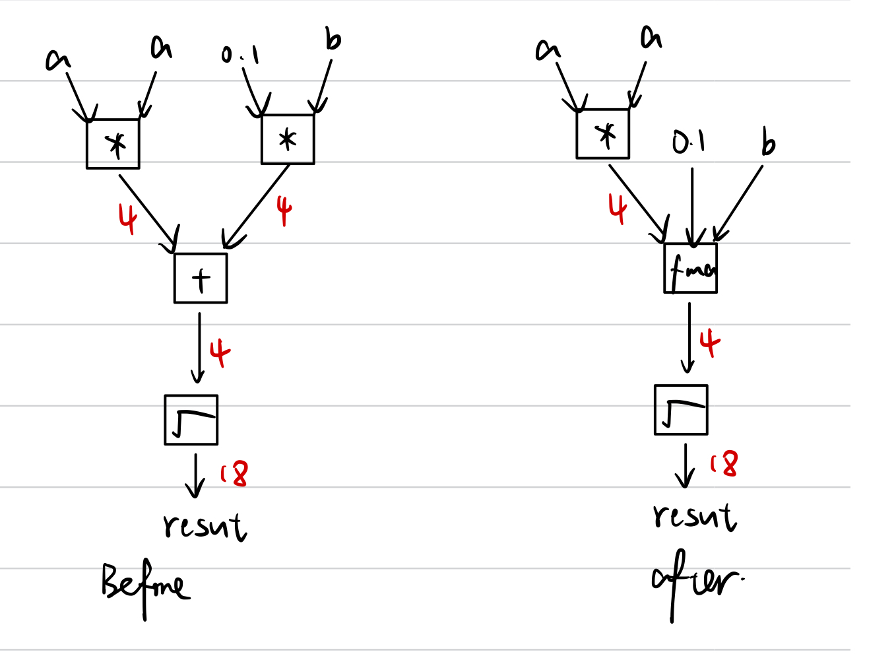

# Advanced System Lab: Assignment 2 Report

## 1. Short Project Info

* (1) Our goal is to implement particle swarm optimization (PSO) specified as follows:

  **Inputs**: 

  * Function to minimize: $f:[a,b]\mapsto\mathbb R$, where $[a,b]\subseteq \mathbb R^d$
  * Population size: $s$
  * Initial swarm positions: $x^{(1)}(0),...,x^{(s)}(0) \in[a,b]$
  * Inertial weighting factor for each iteration: $i(t)$, where $t$ is the iteration number
  * Cognition parameter: $\mu$
  * Social parameter: $v$
  * Minimum and maximum velocities: $v_{min}$ and $v_{max}$
  * Maximum iterations: $T_{max}$

  **Output**:

  * The optimal point found by the algorithm

  We will use a surrogate-based approach to reduce the number of function evaluations in the optimization process implemented by a cubic radial basis function (RBF) surrogate augmented by a linear polynomial tail ([OPUS-RBF algorithm](https://acl.inf.ethz.ch/teaching/fastcode/2022/project/project-ideas/particle-swarm.pdf) page 14-16). 

* (2) A very short explanation of what kind of code already exists and in which language it is written.
  * There is no existing code for this problem. 

## 2. Optimization Blockers

* (a)  Create a table with the runtime numbers of each new function that you created (include at least 2). Briefly discuss the table explaining the optimizations applied in each step.

  | Implementation   | 1      | 2       | 3       | 4     | 5       | 6       | 7       | 8       |
  | ---------------- | ------ | ------- | ------- | ----- | ------- | ------- | ------- | ------- |
  | Runtime (cycles) | 459877 | 93084.8 | 63338.8 | 37575 | 36964.7 | 36973.9 | 18398.2 | 17913.2 |

  The table above shows the runtime in cycles for eight implementations, with optimizations turned on (`-O3 -fno-tree-vectorize`). These experiment is conducted on a Intel Xeon Silver 4210 Cascade Lake processor, and compiled with GCC 8.3.1.

  * Implementation 1: original code
  * Implementation 2: remove some procedure call and performfunction inling  
    * precompute `sqrt(2)`
    * replace `mat_get` and `mat_set` by inliner operations
    * replace `fmax` function by `?:` operator
  * Implementation 3: Change `switch `to `?:` operator
  * Implementation 4: Unrolling the inner loop and outer loop by factor 2 (reduce `%2` operation)
  * Implementation 5: Unrolling the outer loop by factor 2 and inner loop by factor 6 (reduce `%3` operation)
  * Implementation 6: Scalar replacement to reduce memory access
  * Implementation 7: Replace division by multiplication
  * Implementation 8: Move the saving to memory operation to the end of inner loop. 

* (b)  What is the speedup of function `maxperformance `compared to `slowperformance1`?

  The speed up is $24.57$

* (c)  What is the performance in flops/cycle of your function maxperformance.

  * calculate the inverse of the `fmax`: $1$ Flops for each $i=\{0,1,...,z_{n_1}-1\}$. 
    * $z_{n_1}\ flops$  in total.
  * $3$ flops for even operation `((C1 * z_i_j) + x_data[index_i_j])* inv_sqrt_2` for each $(i,j)\in\{(0,0), ...,(z_{n_1}-1,z_{n_2}-2)|(i+j)\mod2=0\}$.
    *  ${3 z_{n_1}(z_{n_2}-1) \over 2}\ flops$ in total.
  * $1$ Flops for odd operation `z_i1_j * inv_y_x_max_i_1` for each $(i,j)\in\{(0,0), ...,(z_{n_1}-1,z_{n_2}-2)|(i+j)\mod2=1\}$.
    *  ${z_{n_1}(z_{n_2} - 1) \over 2}\ flops$  in total.
  * $1$ Flops for operation  `z_i_j + c2y0 ` (`mat_set(z,i,j+1,t3);` in previous code) for each $(i,j) \in \{(0,1), ..., (z_{n_1} - 1, z_{n_2}-1)\}$. 
    * $z_{n_1}(z_{n_2}-1)\ flops$ in total
  * There are $z_{n_1} + 3z_{n_1}(z_{n_2} - 1)$ flops in total. The performance is approximately $1.6\ flops/cycle$ when $z_{n_1}=96, z_{n_2}=97$.

## 3. Microbenchmarks

* (a)  Do the latency and gap of floating point FMA and square root match what is in the Intel Optimization Manual? If no, explain why. (You can also check Agner’s Table).

  ```
  Measured fma  latency       :        4 [cyc]   Correct!
  Measured fma  gap           : 0.505371 [cyc]   Correct!
  Measured sqrt latency       :       18 [cyc]   Correct!
  Measured sqrt gap           :  6.00415 [cyc]   Correct!
  Measured sqrt latency (min) :       13 [cyc]   Correct!
  Measured sqrt gap     (min) :   4.5874 [cyc]   Correct!
  Measured foo  latency       :       26 [cyc]   Correct!
  Measured foo  gap           :  6.00513 [cyc]   Correct!
  Measured foo  latency (min) :       21 [cyc]   Correct!
  Measured foo  gap     (min) :  4.50513 [cyc]   Correct!
  ```

  * Yes, the FMA (latency 4, gap 0.5) and square root (latency 18, gap 6) matches the Intel Optimization manual. 

* (b) Based on the dependency, latency and gap information of the floating point operations, is the measured latency and gap of function `f(x)` close to what you would expect? Justify your answer.

  * Yes, the function includes one multiplication (latency 4, gap 0.5), one FMA (latency 4, gap 0.5), and one sqrt (latency 18, gap 6). The total latency is expected to be $18 + 4 + 4 = 26$. And the total gap is expected to be the bottomneck $max(0.5, 0.5, 6) = 6$

* (c)  Will the latency and gap of `f(x)` change if we compile the code with flags `-O3 -fno-tree-vectorize` (i.e., with FMAs disabled)? Justify your answer and state the expected latency and gap in case you think it will change.

  

  * No. If FMA is disabled, there would be two multiplication (latency 4, gap 0.5), one addition (latency 4, gap 0.5), and one sqrt (latency 18, gap 6). But the length of the critical path remains the same. The gap also doesn’t change because the bottleneck is still $6$. 

