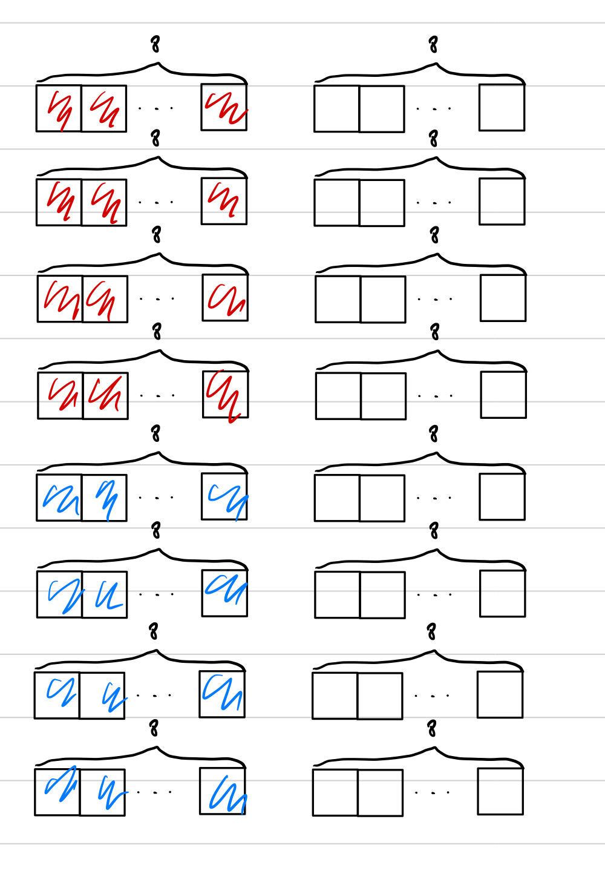
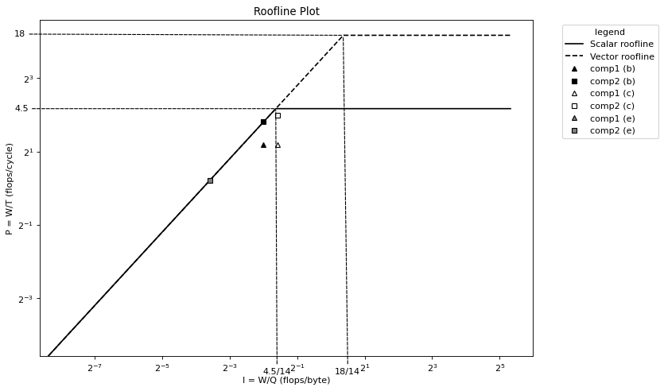

# Advanced System Lab: Assignment 4 Report

## 1. Associativity

We consider a 2-way set associative cache given by (S,E,B) = (8,2,64), where S is the number of sets and B the block size in bytes. To reduce the number of cache misses we design a second cache given by (S′, E′, B′) = (1, 16, 64). In words, this cache has the same size and block size but it is fully associative instead of 2-way set associative. We assume LRU replacement.

We claim that for any code the number of cache misses on the second cache is equal or smaller than the number of misses on the first cache. Do you agree with this statement? If yes, provide a proof. If no, provide a counterexample (i.e., sketch a function operating on some array where it does not hold).

Answer: **No**. According to the description, we have block size $64$ Bytes, which equals to the size of $8$ doubles ($8$ Bytes each). Both of the two caches have 16 blocks. Based on the information, we construct following counter example.

```c++
int n = 4096;
double* x = malloc(n*sizeof(double))
memset(x, 0, n*sizeof(double));
for(int t = 0; t + 8*16*2 - 1 < n; t+=8*16*2){
  // fill cache
  for(int j = 0; j < 16; j++){
      for(int i = 0; i < 8; i++){
  			access(x[t + 8*j + i]);
			}
  }
  // add new data to the cache, then access the
  // least recently used data (replaced data). 
  for(int j = 0, j2 = 15; j < 4, j2 >= 12; j++, j2--){
    for(int i = 0; i < 8; i++){
      access(x[t + 8*16 + 8*j2 + i]);
  		access(x[t + 8*j + i]);
		}
  }
}
```

We firstly fill the cache using the first for loop. Then, we use another for loop to construct conflict misses. We firstly access `8` new data at `t + 8*16 + 8*j2`, then we access `8` old datas at `t + 8*j`.

Since LRU replacement is used, in the first cache, we remove the data at `t + 8*(j2%8) ` . In the second cache, we remove the data `t + 8*j ` since it is least recently used. The following figure shows how the cache is updated in the second loop. The blue part is the cache replaced for the new data. The red part is not changed, and reused in the second line of the second loop. 



But for the second cache, according to LRU, the data accessed in the second line of the second loop will be replaced. Therefore, in this example, there is more cache miss for the second cache. 

## 2. Cache Mechanics

Consider the following code, executed on a machine with a direct-mapped write-back/write-allocate cache with blocks of size $16$ bytes, a total capacity of $128$ bytes and with a LRU replacement policy. Assume that memory accesses occur in exactly the order that they appear. The variables `i,j,t1` and `t2` remain in registers and do not cause cache misses. The matrix A is cache-aligned (first element goes into first cache block) and is stored in row major order. For this and the following exercises, assume a cold cache scenario. `sizeof(double) = sizeof(uint64 t) = 8 bytes`.

```c++
struct pair_t {
	double a;
	double b;
	uint64_t u[3];
};

void comp(pair_t A[3][3]) {
  double t1, t2; 
  // First loop
  for (int i = 0; i < 2; i++) {
    for (int j = 0; j < 3; j++) {
      t1 = A[i+1][j].a;
      t2 = A[i][(j+1)%3].a;
      A[i][j].b = t1 + t2; 
    }
  }
  // Show state of cache at this point
  // Second loop
  for (int i = 0; i < 2; i++) {
    for (int j = 0; j < 3; j++) { 
      t1 = A[(j+1)%3][i].a;
    	t2 = A[j][i+1].a; 
      A[j][i].b = t1 + t2;
    } 
  }
  // Show state of cache at this point
}
```

Basic information of cache:

* block size: $16$ bytes
* set number: $128/16 = 8$ 
* LRU replacement
* write-back/write-allocate

(a)  Considering cache misses from both reads and writes, answer the following. Show your work.

1. Determine the number of hits and misses for executing the first loop (lines 10–16).

   | Access        | Hit/Miss |
   | ------------- | -------- |
   | A\[1\]\[0\].a | Miss     |
   | A\[0\]\[1\].a | Miss     |
   | A\[0\]\[0\].b | Miss     |
   | A\[1\]\[1\].a | Miss     |
   | A\[0\]\[2\].a | Miss     |
   | A\[0\]\[1\].b | Miss     |
   | A\[1\]\[2\].a | Miss     |
   | A\[0\]\[0\].a | Hit      |
   | A\[0\]\[2\].b | Hit      |
   | A\[2\]\[0\].a | Miss     |
   | A\[1\]\[1\].a | Hit      |
   | A\[1\]\[0\].b | Miss     |
   | A\[2\]\[1\].a | Miss     |
   | A\[1\]\[2\].a | Hit      |
   | A\[1\]\[1\].b | Hit      |
   | A\[2\]\[2\].a | Miss     |
   | A\[1\]\[0\].a | Miss     |
   | A\[1\]\[2\].b | Miss     |

   * Hits: 5
   * Misses: 13

2. Draw the state of the cache after the first loop, i.e, at line 17. See the example below that shows how to draw the cache.

   | Set  | 0                            |
   | ---- | ---------------------------- |
   | 0    | A\[1\]\[0\].b A\[1\]\[0\].u0 |
   | 1    | A\[2\]\[0\].u2 A\[2\]\[1\].a |
   | 2    | A\[1\]\[1\].a A\[1\]\[1\].b  |
   | 3    | A\[0\]\[1\].b A\[0\]\[1\].u0 |
   | 4    | A\[2\]\[2\].a A\[2\]\[2\].b  |
   | 5    | A\[1\]\[2\].b A\[1\]\[2\].u0 |
   | 6    |                              |
   | 7    | A\[0\]\[2\].u2 A\[1\]\[0\].a |

3. Determine the number of hits and misses for executing the second loop (lines 19–25).

   | Access        | Hit/Miss |
   | ------------- | -------- |
   | A\[1\]\[0\].a | Hit      |
   | A\[0\]\[1\].a | Miss     |
   | A\[0\]\[0\].b | Miss     |
   | A\[2\]\[0\].a | Miss     |
   | A\[1\]\[1\].a | Miss     |
   | A\[1\]\[0\].b | Miss     |
   | A\[0\]\[0\].a | Miss     |
   | A\[2\]\[1\].a | Hit      |
   | A\[2\]\[0\].b | Hit      |
   | A\[1\]\[1\].a | Hit      |
   | A\[0\]\[2\].a | Miss     |
   | A\[0\]\[1\].b | Hit      |
   | A\[2\]\[1\].a | Hit      |
   | A\[1\]\[2\].a | Miss     |
   | A\[1\]\[1\].b | Hit      |
   | A\[0\]\[1\].a | Miss     |
   | A\[2\]\[2\].a | Miss     |
   | A\[2\]\[1\].b | Miss     |

   * Hits: 7
   * Misses: 11

4. Draw the state of the cache after the second loop, i.e., at the end of the function at line 26.

      | Set  | 0                            |
      | ---- | ---------------------------- |
      | 0    | A\[0\]\[0\].a A\[0\]\[0\].b  |
      | 1    | A\[2\]\[0\].u2 A\[2\]\[1\].a |
      | 2    | A\[2\]\[1\].b A\[2\]\[1\].u0 |
      | 3    | A\[0\]\[1\].b A\[0\]\[1\].u0 |
      | 4    | A\[2\]\[2\].a A\[2\]\[2\].b  |
      | 5    | A\[0\]\[2\].a A\[0\]\[2\].b  |
      | 6    |                              |
      | 7    | A\[2\]\[0\].a A\[2\]\[0\].b  |

(b) Repeat the previous task assuming now that the cache is 2-way set associative (the cache size and block size stay the same).

1. Determine the number of hits and misses for executing the first loop (lines 10–16).

   | Access        | Hit/Miss |
   | ------------- | -------- |
   | A\[1\]\[0\].a | Miss     |
   | A\[0\]\[1\].a | Miss     |
   | A\[0\]\[0\].b | Miss     |
   | A\[1\]\[1\].a | Miss     |
   | A\[0\]\[2\].a | Miss     |
   | A\[0\]\[1\].b | Miss     |
   | A\[1\]\[2\].a | Miss     |
   | A\[0\]\[0\].a | Hit      |
   | A\[0\]\[2\].b | Hit      |
   | A\[2\]\[0\].a | Miss     |
   | A\[1\]\[1\].a | Hit      |
   | A\[1\]\[0\].b | Miss     |
   | A\[2\]\[1\].a | Miss     |
   | A\[1\]\[2\].a | Miss     |
   | A\[1\]\[1\].b | Hit      |
   | A\[2\]\[2\].a | Miss     |
   | A\[1\]\[0\].a | Miss     |
   | A\[1\]\[2\].b | Miss     |

   * Hits: 4
   * Misses: 14

2. Draw the state of the cache after the first loop, i.e, at line 17. See the example below that shows how to draw the cache.

   | Set  | 0                                | 1                                |
   | ---- | -------------------------------- | -------------------------------- |
   | 0    | A\[1\]\[1\].u2 A\[1\]\[2\].a     | **A\[2\]\[2\].a A\[2\]\[2\].b**  |
   | 1    | **A\[1\]\[2\].b A\[1\]\[2\].u0** | A\[2\]\[0\].u2 A\[2\]\[1\].a     |
   | 2    | A\[0\]\[0\].u2 A\[0\]\[1\].a     | **A\[1\]\[1\].a A\[1\]\[1\].b**  |
   | 3    | A\[2\]\[0\].a A\[2\]\[0\].b      | **A\[0\]\[2\].u2 A\[1\]\[0\].a** |

3. Determine the number of hits and misses for executing the second loop (lines 19–25).

   | Access        | Hit/Miss |
   | ------------- | -------- |
   | A\[1\]\[0\].a | Hit      |
   | A\[0\]\[1\].a | Hit      |
   | A\[0\]\[0\].b | Miss     |
   | A\[2\]\[0\].a | Hit      |
   | A\[1\]\[1\].a | Hit      |
   | A\[1\]\[0\].b | Miss     |
   | A\[0\]\[0\].a | Hit      |
   | A\[2\]\[1\].a | Hit      |
   | A\[2\]\[0\].b | Hit      |
   | A\[1\]\[1\].a | Hit      |
   | A\[0\]\[2\].a | Miss     |
   | A\[0\]\[1\].b | Miss     |
   | A\[2\]\[1\].a | Hit      |
   | A\[1\]\[2\].a | Miss     |
   | A\[1\]\[1\].b | Hit      |
   | A\[0\]\[1\].a | Hit      |
   | A\[2\]\[2\].a | Miss     |
   | A\[2\]\[1\].b | Miss     |

   * Hits: 11
   * Misses: 7

4. Draw the state of the cache after the second loop, i.e., at the end of the function at line 26.

      | t    | 0                               | 1                                |
      | ---- | ------------------------------- | -------------------------------- |
      | 0    | **A\[2\]\[2\].a A\[2\]\[2\].b** | A\[1\]\[1\].u2 A\[1\]\[2\].a     |
      | 1    | A\[0\]\[2\].a A\[0\]\[2\].b     | **A\[2\]\[0\].u2 A\[2\]\[1\].a** |
      | 2    | A\[0\]\[0\].u2 A\[0\]\[1\].a    | **A\[2\]\[1\].b A\[2\]\[1\].u0** |
      | 3    | A\[2\]\[0\].a A\[2\]\[0\].b     | **A\[0\]\[1\].b A\[0\]\[1\].u0** |

## 3. Rooflines

- SIMD vector length of 256 bits.

- The following instruction ports that execute floating point operations:

  - Port 0 (P0): FMA, ADD, MUL 
  - Port 1 (P1): FMA, ADD, MUL
  - Port 2 (P2): DIV

  Ports 0 and 1 can issue 1 instruction per cycle and each instruction has a latency of 1. Port 2 can only issue 1 division every two cycles with a latency of two, i.e., Gapdiv = 2 and Latencydiv = 2.

- One write-back/write-allocate cache with blocks of size 64 bytes. (8 doubles)
- Read bandwidth from the main memory is 42 GB/s.
- Processor frequency is 3 GHz.

Plot: 



(a)  Draw a roofline plot for the machine. Consider only double-precision floating point arithmetic. Consider only reads. Include a roofline for when vector instructions are not used and for when vector instructions are used.

Answer: The maximum performance is achieved when executing 1 division (port 2) and 2 FMAs (port 0, 1) per cycle. Thus, $\pi_s = 2*2 + 0.5 = 4.5 flops/cycle$ and $\pi_v = 4 * 4.5 = 18\ flops/cycle$ for scalar and vectorized code respectively. The rooflines are $P \leq \pi_s$, $P \leq \pi_v$ and $P \leq I \beta$, where $\pi_s = 4.5, \pi_v = 18$ and $\beta = 42 / 3= 14 \ Bytes/cycle$. 

(b) Consider the following functions. For each, assume that vector instructions are not used, and derive hard upper bounds on its performance and operational intensity (consider only reads) based on its instruction mix and compulsory misses. Assume that `s1 = s2 = 1`. Ignore the effects of aliasing and assume that no optimizations that change operational intensity are performed (the computation stays as is). FMAs are used to fuse an addition with a multiplication whenever applicable. All arrays are aligned (first element goes into first cache set) and don’t overlap in memory. Assume you write code that attains these bounds, and add the performance to the roofline plot (there should be two dots).

```c++
void comp1(double *x1, double *x2, double *y, double *z, int s1, int s2, int n) { 
  double a = 0.1;
  for (int i = 0; i < n; i++) {
		// two add => two multiply
    x1[i] = a * (x1[i] + y[i]) * (x1[i] + z[s1*i]);
		// two add => one fma
    x2[i] = a + (x2[i] + y[i]) * (x2[i] + z[s2*i]); 
  }
}
void comp2(double *x1, double *x2, double *y, double *z, int s1, int s2, int n) { 
  double a = 0.1;
  for (int i = 0; i < n; i++) {
    // one fma => one fma
    x1[i] = a + (x1[i] * y[i]) + (x1[i] * z[s1*i]);
    // one multiply => one division => one fma
    x2[i] = a / (x2[i] * y[i]) + (x2[i] * z[s2*i]); 
  }
}
```

Answer: 

 $W(n) = 8n$. Consider only reads and compulsory misses, a lower bound on the number of bytes transferred is $Q(n) \geq double\_size * data\_access = 8(4n) = 32n\ bytes$. 

* `comp1`

  * Operational intensity: $I(n) \leq 8n/32n =  0.25\ flops/byte$. 

  * Performance: $\min(8n / 3.5n, 0.25 * 14) = 16/7 \approx 2.28571\ flops/cycle$ 

* `comp2`

  * Operational intensity: $I(n) \leq 0.25\ flops/byte$. 
  * Performance: $\min(8n / (2n + 2), 0.25 * 14) = 3.5\ flops/cycle (n > 7)$  

(c) Follow the same assumptions as in part (b) and derive hard upper bounds on the operational intensity and performance of each function assuming now that `s1 = s2 = 0` (without vectorization). Add the new performance of each function to the roofline plot (two additional dots).

Answer: Now the number of bytes transferred becomes the following equation since we only need to access `z[0]`. 
$$
Q(n) \geq double\_size * data\_access = 8(3n + 1) = 24n + 8\ bytes
$$

* `comp1`: 
  * Operational intensity: $I(n) \leq W(n) /Q(n) = 8n / 8(3n + 1) < 1/3 \approx 0.33333\ flops/byte$ 
  * Performance: $\min(16/7, (1/3) * 14) = 16/7 \approx 2.28571\ flops/cycle$  
* `comp2`:
  * Operation intensity: $I(n) \leq 8n / 8(3n + 1) < 1/3 \approx 0.33333\ flops/byte$
  * Performance: $\min(8n / (2n + 2), (1/3) * 14) = 8n / (2n + 2)\ flops/cycle \approx 4 \ flops/cycle(n > 7)$   

(d) For each computation in part (c), i.e., assuming that `s1 = s2 = 0`, what is the maximum speedup you could achieve by parallelizing it with vector intrinsics?

Answer: When the code is parallelized, the operational intensity is not changed (since the code is not changed). And the computation becomes memory bound. Therefore, the maximum speed up is:

* `comp1`: ${{14/3} \over {16/7}} \approx 49/24 = 2.04167$ 
* `comp2`: ${{14/3} \over {8n / (2n + 2)}} = {7n + 7 \over 6n} \approx 7/6 \approx 1.16667$ 

(e) Repeat part (b) assuming that `s1 = 2` and `s2 = 16`. Add the new performance of each function to the roofline plot (two additional dots).

 $W(n) = 8n$. Consider only reads and compulsory misses, a lower bound on the number of bytes transferred is $Q(n) \geq double\_size * data\_access = 8(3n + (2n + 7n)) = 96n\ bytes$. 

* `comp1`

  * Operational intensity: $I(n) \leq 8n / 96n = 1/12 \approx 0.08333\ flops/byte$. 

  * Performance: $\min(16/7, 1/12 * 14) = 7/6\approx 1.16667\ flops/cycle$ 

* `comp2`

  * Operational intensity: $I(n) \leq 8n / 96n = 1/12 \approx 0.08333\ flops/byte$. 
  * Performance: $\min(8n / (2n + 2), 1/12 * 14) = 7/6 \approx 1.16667\ flops/cycle (n > 7)$  

## 4. Cache Miss Analysis

Consider the following computation that performs a matrix multiplication $C = C + AB$ of square

matrices $A, B$ and $C$ of size $n × n$ using a $k-i-j$ loop. 

```c++
void mmm_kij(double *A, double *B, double *C, int n) {
  for(int k = 0; k < n; k++)
    for(int i = 0; i < n; i++)
      for(int j = 0; j < n; j++)
  			C[n*i + j] += A[n*i + k] * B[n*k + j];
}
```

Assume that the code is executed on a machine with a write-back/write-allocate fully-associative cache with blocks of size $64$ bytes, a total capacity of $γ$ doubles and with a LRU replacement policy. Assume that $n$ is divisible by $8$, cold caches, and that all matrices are cache-aligned.

(a) Assume that $γ << n$ and answer the following. Justify your answers.

*  Determine, as precise as possible, the total number of cache misses that the computation has.

  Answer: 

  * The last inner loop will fix `A[n*i + k]` and iterate `B[n*k + j]` and `C[n*i + j]` . Since $\gamma << n$, data replacement will happen. Since LRU is used, when the cache is full, the least recently used `B[n*k + j]` will be only replaced by later `B[n*k + j]`, and the least recently used `C[n*i + j]` will be only replaced by later `C[n*i + j]`. Therefore , for each fixed `A[n*i + k]` , the total misses is $miss(A) + miss(B) + miss(C)=1 + n/8 + n/8 =1 + n/4$. 
  * For the second inner loop, there are $n(1 + n/4) = n + n^2/4$ misses.
  * For the outer loop, there are $n^2 + n^3/4$ misses.

* For each of the matrices ($A, B$ and $C$), state the kind(s) of locality it benefits from to reduce misses.

  Answer

  * $A$: Temporal locality
  * $B$: Spatial locality
  * $C$: Spatial locality

(b) Repeat the previous task assuming now that $γ = 3n$ doubles.

*  Determine, as precise as possible, the total number of cache misses that the computation has.

  Answer: 

  * The last inner loop will fix `A[n*i + k]` and iterate `B[n*k + j]` and `C[n*i + j]`. Since the second inner loop will fix $k$, the same row of $B$ will be used for next `i`. Therefore, the replacement happens when the cache is full (contains one row of $B$ and roughly two rows of C). For the first inner loop, we have $1 + n/4$ misses for the first iteration, and $miss(A) + miss(B) + miss(C) = 1 + 0 + n/8 = 1 + n/8$ misses for the rest of iterations. 
  * For the second inner loop: $1 + n/4 + (n-1) * (1 + n/8) = 9n/8 + n^2/8$ misses.
  *  For the outer loop: $9n^2/8 + n^3/8$ misses.

* For each of the matrices ($A, B$ and $C$), state the kind(s) of locality it benefits from to reduce misses.

  Answer

  * $A$: Temporal locality
  * $B$: Temporal and spatial locality
  * $C$: Spatial locality

(c) Determine the minimum value for $γ$, as precise as possible, such that the computation only has compulsory misses. For this, assume that LRU replacement is not used and, instead, cache blocks are replaced as effectively as possible to minimize misses.

Answer: For `A`, we need to make sure the first block accessed is preserved in the cache when `k` is changed, which means that matrix `C` should be in the cache, and the all blocks used for the first `k` are preserved (otherwise, the first block of `A` will be replaced). Therefore, $\gamma \geq n^2 + 9n$ 
